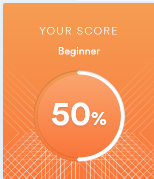

# Dmitriy Firsov 
## Contact 
*  (krakeni#6635) 
*  (@firsov_d)
## Information
* I am 23 years old. I am currently completing my 4th year at the Polytechnic College. I have been studying front-end technologies and computer science for 2 years now. I also have experience using Python. I see something beautiful in technology and IT. This is one of those areas where you can learn almost forever
* I get along well with people because I worked as a bartender for a long time. A huge thirst for knowledge and development.
## Skils
*  (* )
* 
* 
* 
* 
* 
## Code
```javascript
function fibonacci(num, list) {
    if (num === 0 || num === 1) {
        return num === 0 ? 0 : list[list.length - 1];
    }

    newList = [...list, list[list.length - 2] + list[list.length - 1]];

    return fibonacci(num - 1, newList);
}
```
## Practice
* [Html,SCSS,JS](https://rolling-scopes-school.github.io/firsov-dmitriy-JSFE2022Q1/shelter/pets/index.html)
* [React](https://rss-react.vercel.app/)
## Education
* Polytechnic College
* Udemy - Полный курс по JavaScript + React 
* Udemy - React + Redux
* https://stepik.org/cert/1050849
* https://stepik.org/cert/904957
## Language
* English 

    
